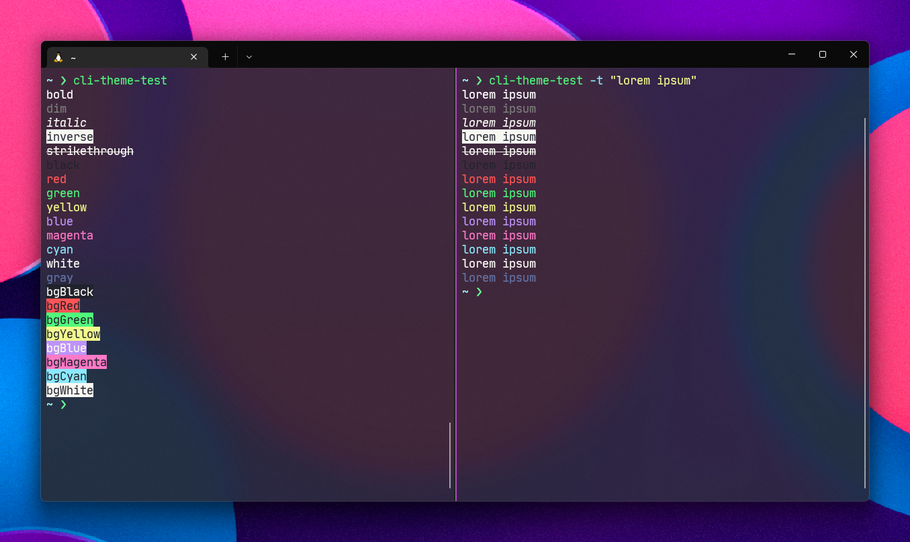

# CLI Theme Test
A simple tool that allows you to check your command-line theme.



## How to Install
```sh
npm i -g cli-theme-test
```

## How to Use
Once the package is installed globally, run the tool in your terminal of choice:
```sh
# Default output
cli-theme-test

# Text colors only
cli-theme-test -t

# Background colors only
cli-theme-test -b

# Prints "lorem ipsum" with the colors
cli-theme-test "lorem ipsum"
```

### Options
- `-V, --version`: Outputs the version number
- `-b, --background`: Limits the test to background colors
- `-t, --text`: Limits the test to text colors
- `-h, --help`: Displays CLI help

### Arguments
- `[message]`: An optional message to print with the colors